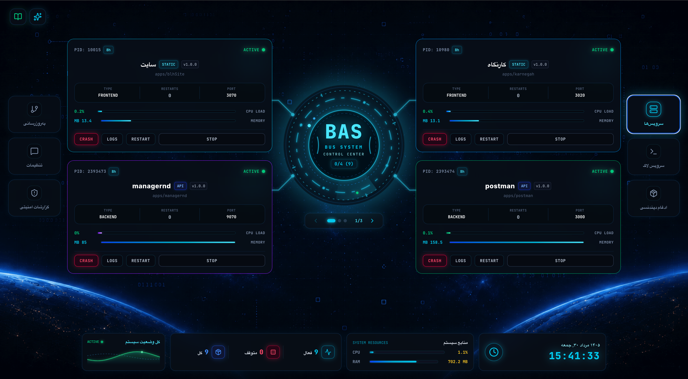

<div dir="rtl">

# 🚀 سامانه BAS (ارکستراتور بومی Node.js)

[](https://github.com/mohammadnjt/bas)

<!-- عکس پیش‌نمایش داشبورد -->
<div align="center">
  
</div>

**BAS** یک سیستم مدیریت پروسه و ارکستراتور مدرن، هوشمند و بومی برای برنامه‌های مبتنی بر Node.js (بک‌اند و فرانت‌اند) است. این سامانه به عنوان یک جایگزین پیشرفته برای ابزارهایی نظیر `PM2` طراحی شده و با داشتن رابط کاربری گرافیکی قدرتمند، هوش مصنوعی یکپارچه و لایه‌های امنیتی سخت‌گیرانه، مدیریت سرورها و اپلیکیشن‌ها را بسیار ساده و امن می‌کند.

---

## ✨ ویژگی‌های کلیدی

### ۱. مدیریت هوشمند پروسه‌ها (Process Management)
- **پایش زنده منابع:** نمایش لحظه‌ای میزان مصرف CPU و حافظه RAM کل سیستم و هر برنامه به صورت مجزا.
- **Auto-Restart Engine:** شناسایی خودکار کرش‌ها و راه‌اندازی مجدد برنامه‌ها با تاخیر و سقف مشخص.
- **نمایش زنده لاگ‌ها (Live Logs):** دسترسی بلادرنگ به خروجی کنسول اپلیکیشن‌ها همراه با قابلیت جستجو، فیلتر و Auto-scroll.

### ۲. امنیت پیشرفته و دفاع فعال (Advanced Security)
- **احراز هویت با API Key:** دسترسی به پنل تنها از طریق توکن‌های امن (Cookie/Header) امکان‌پذیر است.
- **لیست سفید آی‌پی‌ها (IP Whitelisting):** محدود کردن دسترسی پنل تنها به IPهای خاص تعریف شده در `.env`.
- **محافظت در برابر Brute-force:** مسدودسازی اتوماتیک ۲۴ ساعته IP هکرها پس از ۵ تلاش ناموفق برای ورود.
- **هدرهای امنیتی و Rate Limiting:** استفاده از پکیج `helmet` و محدودکننده درخواست (۲۰۰ درخواست در ۱۵ دقیقه) برای دفع حملات DoS و XSS.
- **داشبورد امنیتی:** مشاهده زنده لاگ‌های ورود موفق/ناموفق و مدیریت لیست سیاه (Banned IPs) در داخل پنل.

### ۳. هوش مصنوعی عیب‌یاب (AI Diagnostics)
- مجهز به دستیار هوشمند مبتنی بر **Google Gemini API**.
- قابلیت بررسی خودکار لاگ‌های کرش شده، ریشه‌یابی خطاها (Root Cause Analysis) و ارائه راهکارهای عملیاتی برای رفع باگ.

### ۴. سیستم هشدار پیامکی (SMS Alerts)
- یکپارچه با درگاه پیامکی (BLH SMS Gateway) از طریق پترن OTP.
- **ارسال پیامک آنی در دو حالت:**
  1. هنگام کرش کردن و متوقف شدن اپلیکیشن‌ها.
  2. هنگام تشخیص حمله امنیتی و بن شدن آی‌پی هکر.

### ۵. مدیریت گروهی و اتوماسیون (Automation Tools)
- **به‌روزرسانی گروهی گیت (Bulk Git Update):** گرفتن `git pull` همزمان روی ده‌ها مخزن با استفاده از جستجوی کلمه کلیدی.
- **ادغام خودکار وابستگی‌ها (Dependency Merger):** اسکن هوشمند تمام پروژه‌های ساب‌فولدر، استخراج `package.json` ها، ادغام پکیج‌ها و نصب یکپارچه برای کاهش حجم اشغالی (مناسب معماری مونو-ریپو).

---

## 🛠 تکنولوژی‌های استفاده شده

- **فرانت‌اند:** React 18, TypeScript, Tailwind CSS, Framer Motion, Lucide Icons
- **بک‌اند:** Node.js, Express.js, Child_Process API, Vite Middleware
- **امنیت:** Helmet, Express-Rate-Limit
- **هوش مصنوعی:** `@google/genai` (Gemini)

---

## 📦 راهنمای نصب و راه‌اندازی

### پیش‌نیازها
- نصب بودن Node.js (نسخه ۱۸ به بالا)
- سیستم‌عامل لینوکس/مک/ویندوز

### ۱. دریافت و نصب
ابتدا پروژه را کلون کرده و وابستگی‌ها را نصب کنید:
```bash
git clone https://github.com/mohammadnjt/bas.git
cd bas
npm install
```

### ۲. تنظیمات محیطی (.env)
یک فایل `.env` در ریشه پروژه بسازید (می‌توانید از فایل `.env.example` الگو بگیرید):

```env
# کلید امنیتی اختصاصی شما برای ورود به پنل
ADMIN_API_KEY=your_super_secret_key

# (اختیاری) توکن هوش مصنوعی گوگل برای سیستم عیب‌یاب
GEMINI_API_KEY=your_gemini_api_key

# آدرس پایه سرویس پیامک و توکن آن برای دریافت هشدارهای کرش و امنیت
SMS_API_URL=https://your-sms-provider.com/api/send
SMS_APIKEY_BAS=your_sms_gateway_token

# (اختیاری) آدرس ریدایرکت برای کاربران غیرمجاز (اگر تنظیم شود، کاربران بدون دسترسی به این آدرس منتقل می‌شوند)
UNAUTHORIZED_REDIRECT_URL=https://your.domain.ir

# لیست سفید آی‌پی‌ها جهت دسترسی به پنل (با کاما جدا شوند). خالی گذاشتن = دسترسی آزاد
ALLOWED_IPS=192.168.1.100,10.0.0.5
```

### ۳. بیلد و اجرای سیستم در محیط Production
از آنجایی که سیستم نیازمند مدیریت فایل‌ها و اجرای دستورات است، بیلد نهایی از طریق `esbuild` ساخته می‌شود:

```bash
# کامپایل فرانت‌اند و بک‌اند به صورت یکپارچه
npm run build

# اجرای سیستم
npm run start
```
*سامانه به صورت پیش‌فرض بر روی پورت `3000` اجرا خواهد شد.*

---

## 📂 نحوه تعریف اپلیکیشن‌ها

سیستم BAS اپلیکیشن‌های شما را از روی پوشه `apps` به صورت خودکار شناسایی می‌کند. برای پیکربندی هر اپلیکیشن، کافیست یک فایل به نام `bas.config.json` در ریشه پوشه همان اپلیکیشن ایجاد کنید. 

> سیستم منحصراً برای دریافت پیکربندی از فایل `bas.config.json` استفاده می‌کند.

### نمونه فایل `bas.config.json`
این فایل تمامی مشخصات اجرایی و گروه‌بندی سرویس شما را تعیین می‌کند:

```json
{
  "name": "foodrond",
  "type": "backend",
  "entry": "server.js",
  "port": 9009,
  "autoStart": true,
  "groups": ["payment", "core"]
}
```

- **`type`**: می‌تواند `backend` یا `frontend` باشد.
- **`entry`**: فایل اجرایی (برای بک‌اند مثل `server.js`) یا مسیر بیلد (برای فرانت‌اند مثل `dist`).
- **`groups`**: (جدید) آرایه‌ای از نام گروه‌ها. با استفاده از این فیلد می‌توانید اپلیکیشن‌های مرتبط را در یک گروه قرار داده و از طریق تب آپدیت گروهی (با وارد کردن نام گروه) تمامی آن‌ها را با یک کلیک بروزرسانی کنید.

---

## 🛡️ مسیر ورود به پنل

برای ورود به داشبورد، از آنجایی که صفحه لاگین مرسوم به دلایل امنیتی حذف شده است، باید مسیر ورود را همراه با `ADMIN_API_KEY` در مرورگر باز کنید:

```text
http://your-server-ip:3000/<ADMIN_API_KEY>
```
*مثال:* اگر `ADMIN_API_KEY=mySecret123` باشد، آدرس ورود `http://domain.com:3000/mySecret123` خواهد بود. پس از یکبار ورود موفق، کوکی دسترسی برای یک‌سال روی سیستم شما ست می‌شود. در صورت دسترسی غیرمجاز سایر افراد، مستقیماً به آدرس ریدایرکت (`UNAUTHORIZED_REDIRECT_URL`) یا وب‌سایت اصلی منتقل می‌شوند.

</div>